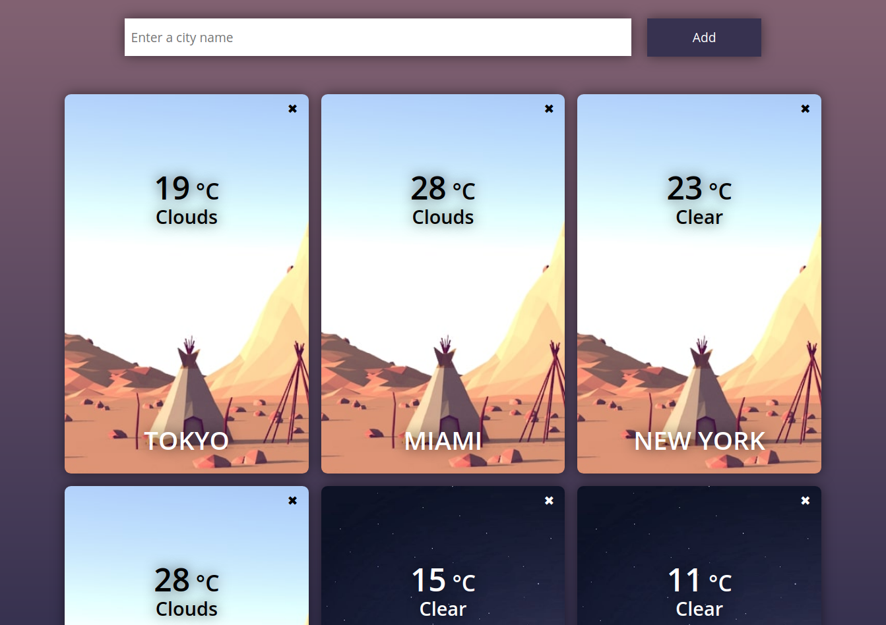

# Weather_App
Flask and SqlAlchemy app

Run in cmd :
<code>git clone https://github.com/Str1kez/Weather_App.git</code> or go to downloaded folder

You must have **Python 3.9+**

Create `venv`, install packages from `requirements.txt`

Run `app.py`

Go to http://127.0.0.1:5000/ in browser

